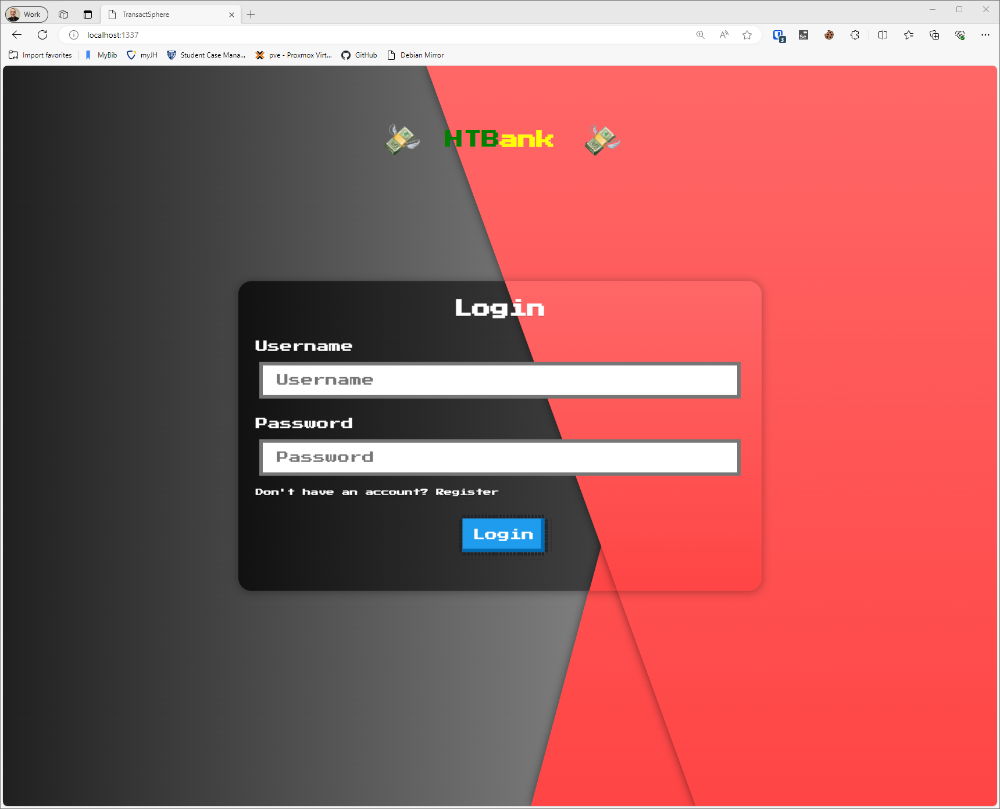
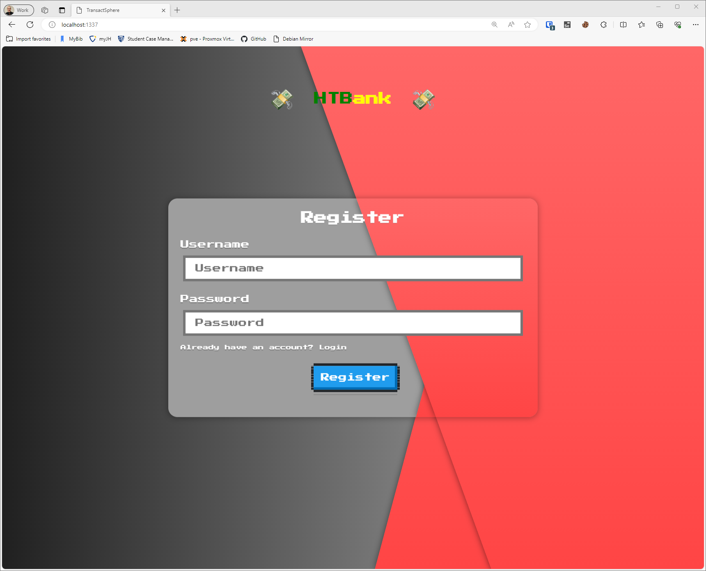
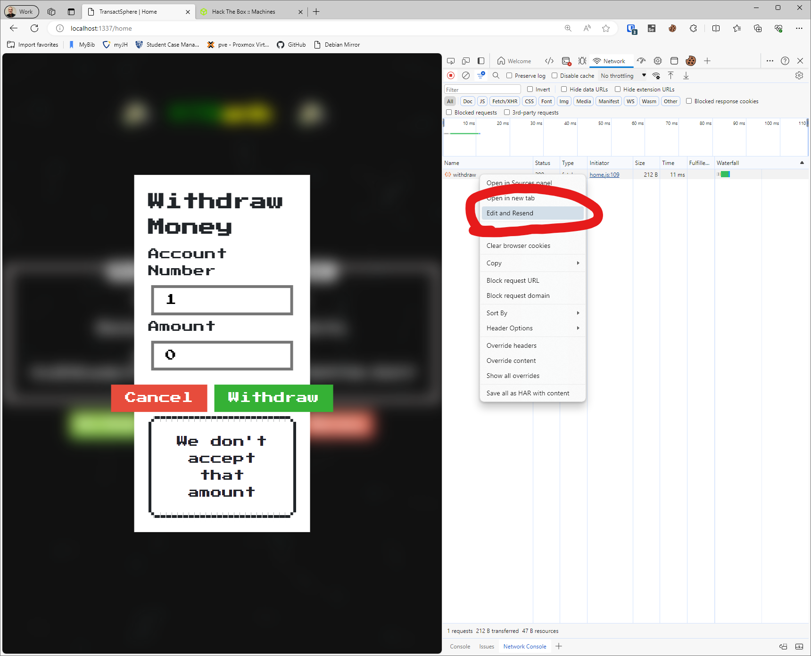
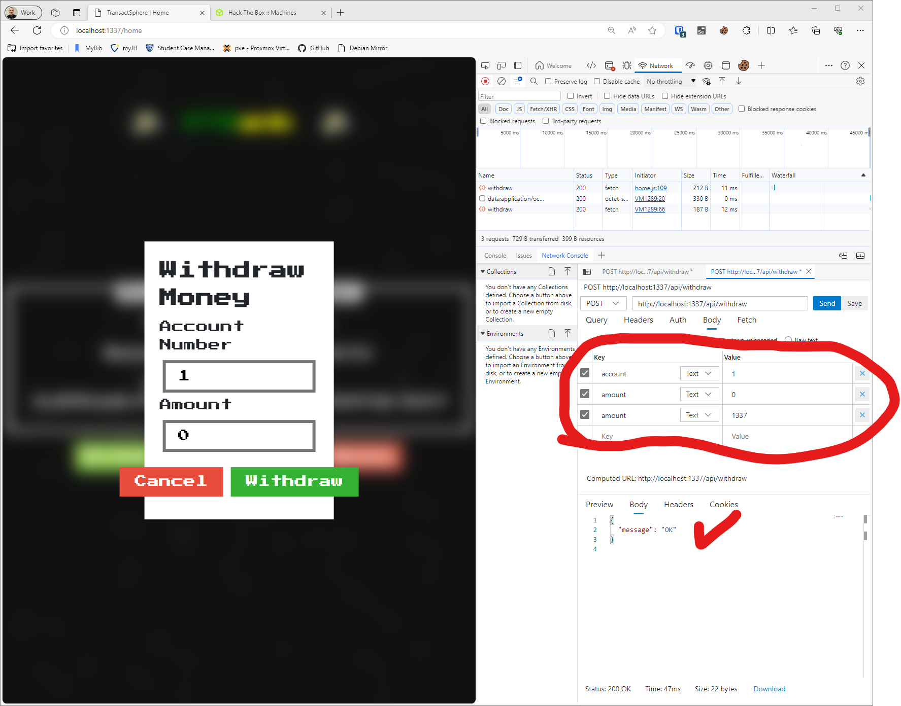
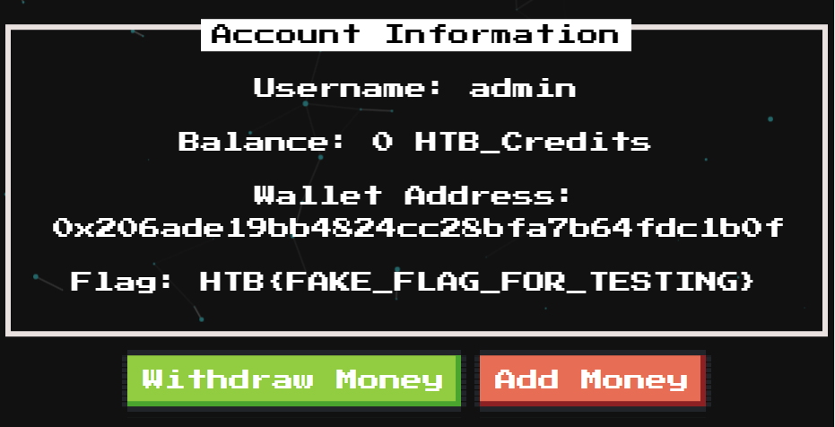
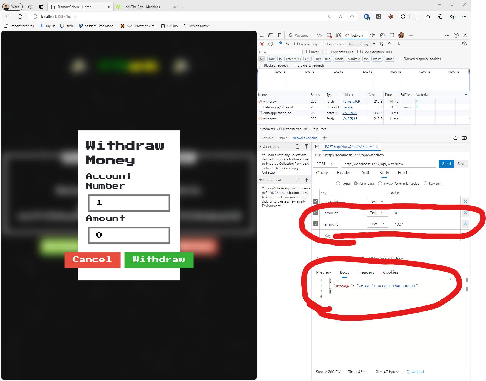

# HTB - HTBank Challenge Exploit and Mitigation Walkthrough

This challenge exploits a HTTP Parameter Pollution flaw that occurs when duplicate keys are utilized between two different platforms. The specific platforms in question are flask and php. When a duplicate key is provided in a form response the flask frontend will default to the first and the php backend will default to the last.

## Tools Used

- Browser with Developer Console Capability (I used Edge)

## Walkthrough

### Code Recon

The flag is displayed in the `/home` endpoint if the `show_flag` variable is set to `1`:

```python
@web.route('/home')
@isAuthenticated
def home(decoded_token):
    user = getUser(decoded_token.get('username'))
    flag = getFlag()
    
    if(flag[0].get('show_flag') == 1):
        return render_template('home.html', user=user[0], flag=flag[0].get('flag'))


    return render_template('home.html', user=user[0])
```

An initial look at the code rules out some attack vectors. While the balance used to check if the user has enough credits to call the backend withdraw endpoint is pulled from the JWT token:

```python
@api.route('/withdraw', methods=['POST'])
@isAuthenticated
def withdraw(decoded_token):
    # ...
    user = getUser(decoded_token.get('username'))

    try:
        if (int(user[0].get('balance')) < int(amount) or int(amount) < 0 ):
            return response('Not enough credits!'), 400

        res = requests.post(f"http://{current_app.config.get('PHP_HOST')}/api/withdraw", 
            headers={"content-type": request.headers.get("content-type")}, data=body)
    # ...
```

However, we cannot modify the JWT token. The algorithm used is `HS256` and the key is a randomly generated 50-character hex string, which is not reasonable to brute force:

```python
generate = lambda x: os.urandom(x).hex()
key = generate(50)
#...
def createJWT(username):
    token_expiration = datetime.datetime.utcnow() + datetime.timedelta(minutes=360)
    
    encoded = jwt.encode(
        {
            'username': username,
            'exp': token_expiration
        },
        key,
        algorithm='HS256'
    )

    return encoded
```

This leads us to focus on the following switch statement:

```python
        if (int(user[0].get('balance')) < int(amount) or int(amount) < 0 ):
            return response('Not enough credits!'), 400
```

From the `entrypoint.sh` we can see that the table definition defaults 'balance' to zero:

```sql
CREATE TABLE web_htbank.users (
    id INTEGER PRIMARY KEY AUTO_INCREMENT,
    username VARCHAR(255) NOT NULL UNIQUE,
    password VARCHAR(255) NOT NULL,
    balance INTEGER NOT NULL DEFAULT 0,
    wallet_address VARCHAR(255) NOT NULL
);
```

Thus, for a newly registered user with no balance, we can fill in the blanks on the switch statement as follows:

```python
      # if (int(user[0].get('balance')) < int(amount) or int(amount) < 0 ):
        if (0                           < int(amount) or int(amount) < 0 ):
            return response('Not enough credits!'), 400
```

This leaves the only possible input to use for the amount on a new account to be 0. After this it calls the backend service written in PHP. The endpoint `/api/withdraw` defined in the `WithdrawController.php`:

```php
<?php

class WithdrawController extends Controller
{
    public function __construct()
    {
        parent::__construct();
    }

    public function index($router)
    {
        $amount = $_POST['amount'];
        $account = $_POST['account'];

        if ($amount == 1337) {
            $this->database->query('UPDATE flag set show_flag=1');

            return $router->jsonify([
                'message' => 'OK'
            ]);
        }

        return $router->jsonify([
            'message' => 'We don\'t accept that amount'
        ]);
    }
}
```

Clearly the amount needs to be 0 to get through the flask application checks and 1337 for the php application to set the `show_flag` variable to 1 and allow the frontend to display the flag. This points to a duplicate key vector as an attack vector.

To verify the viability, we can simply open a php and python shell and check how they parse duplicate keys:

```bash
$> python3
Python 3.11.2 (tags/v3.11.2:878ead1, Feb  7 2023, 16:38:35) [MSC v.1934 64 bit (AMD64)] on win32
Type "help", "copyright", "credits" or "license" for more information.
>>> print({"a":1,"a":2})
{'a': 2}
>>> quit()
$> php -a
Interactive mode enabled

php > $arr = [ "a" => "1", "a" => "2" ];
php > print $arr["a"];
2
php > exit
$>
```

This is all the information we need to confirm our attack vector as a duplicate key vulnerability which is enumerated as CWE-462: Duplicate Key in Associative List (Alist) [1]. Since this duplicate key is delivered through http parameters, CWE-235: Improper Handling of Extra Parameters [2] is also relevant.

### Exploit

For this demo I used the provided docker container. The provided docker-build script has all the steps necessary to launch an instance of the vulnerable app.

```bash
docker rm -f web_htbank
docker build --tag=web_htbank .
docker run -p 1337:1337 --rm web_htbank
```

After launching we can navigate to [http://localhost:1337](http://localhost:1337). The app has a simple login frontend with a registration page:





Using the registration page I created a user `admin` with the password `test`, but it is not important what is chosen here. I then logged in and was greeted with the home page:


The `Add Money` button has no action bound to it. However, we can use the `Withdraw Money` button. The dialog requests and account and amount and knowing the first entrypoint being hit will be the frontend flask application we can use the known `0` value that gets us past the aforementioned switch statement that checks the amount in python. Before doing this of course, we need to open up the developer console and capture the network event in the `Network` tab:



Obviously, we have n0t succeeded yet. To get across the finish line, we can right-click the event and use the `Edit and Resend` function to manipulate the payload.

As mentioned before, python will read the first value in a duplicate key scenario and php will read the last value in a duplicate key scenario. All we would need to do is add a duplicate entry in the payload with the key `amount` and the value `1337`. After doing that we can hit `Send` and should get a response that is simply `{"message": "OK"}` from the server:



At this point all we need to do is refresh the home page and the flag should present itself:



## Mitigation

The ultimate vulnerable line of code is in the flask application where the body is passed to the php backend without modification:

```python
        res = requests.post(f"http://{current_app.config.get('PHP_HOST')}/api/withdraw", 
            headers={"content-type": request.headers.get("content-type")},
            # Body forwarded without modification, yields the CWE-462/CWE-235 vector 
            data=body)
```

Since the `account` and `amount` values were already parsed by python AND we want the python and php components to have the same values for both, we can simply re-format the request body for the php backend using the values python parsed from the request body:

```python
        res = requests.post(f"http://{current_app.config.get('PHP_HOST')}/api/withdraw", 
            headers={"content-type": request.headers.get("content-type")},
            # Body re-formatted with values parsed by the python interpreter
            data={"account": account, "amount": amount})
```

After making this modification and re-building/launching the container, the attack vector is no longer viable since python's method of parsing associative arrays with duplicate keys is enforced:



## References

[1]“CWE - CWE-462: Duplicate Key in Associative List (Alist) (4.13),” cwe.mitre.org. Available: [https://cwe.mitre.org/data/definitions/462.html](https://cwe.mitre.org/data/definitions/462.html). [Accessed: Jan. 26, 2024]

[2]“CWE - CWE-235: Improper Handling of Extra Parameters (4.13),” cwe.mitre.org. Available: [https://cwe.mitre.org/data/definitions/235.html](https://cwe.mitre.org/data/definitions/235.html). [Accessed: Jan. 26, 2024]
